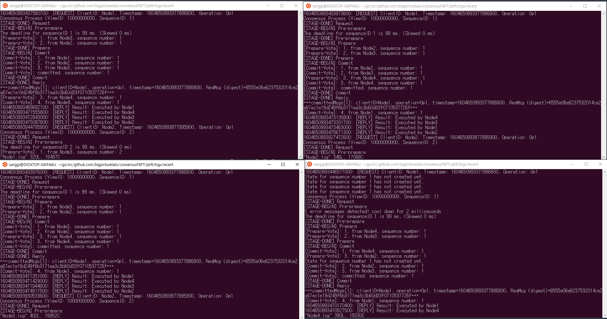

# PBFT(Practical Byzantine Fault Tolerance) Algorithm

## <b>1. Architecture</b>

<br>

## <b>2. 시스템 모델(전제조건) 요약</b >
* 메시지 전달 지연, 실패, 무작위 순서인 비동기 네트워크 환경 허용.
* Crash fault와 달리, 일부러 잘못된 메세지를 전송 하거나  데이터 전송을 지연시키는 악의적인 노드(Byzantine)가 있다고 가정.
* 메세지는 언젠가는 전달한다(liveness)
* 비대칭키 암호화 및 서명, 해시값 등을 통해 완벽한 신뢰성이 보장되지 않는 환경에서도 무결성 및 송신자 확인을 보장할 수있음.


## <b>3. 왜 합의에 필요한 전체 노드수(N)는 3f + 1일까?</b>
전체 노드 수가 N이고, 장애 또는 악의적인 노드가 f개 일때, 정상적인 합의를 위한 최소한의 노드 수는 N=3f+1이다.<br>
PBFT에서는 2가지 장애 상황이 있는데 먼저 정상적으로 메세지를 보냈지만 전송되지 않는 f대의 경우가 있다. 이때 합의를 위해서는 전체 N개중 장애 노드인 f개를 뺀 N - f대의 노드에 악의적으로 잘못된 메세지를 보내는 노드 f대를 뺀 (N - f) - f대의 노드로 합의를 이루어야 한다. 합의를 이루기 위해선, (N - f) - f대의 노드가 장애 또는 악의적인 노드인 f대 보다 많아야 하는 (N - f) - f > f 조건이 성립되기 때문에 N > 3f를 만족하는 최소한의 조건 <b>N = 3f + 1</b>이 성립 된다.

## <b>4. 동작과정</b>
### <b>4.1 요약</b>
* client는 먼저 합의할 request 메세지를 primary노드에게 전송한다.
* client로 부터 request메세지를 수신받은 primary노드는 나머지 backup노드들에게 request메세지가 담긴 pre-prepare 메세지를 전송한다.
* primary로 부터 pre-prepare메세지를 수신받은 backup노드들은 prepare, commit phase를 통해 각자 결과값을 도출 한다.
* client 노드는 f + 1개의 동일한 응답을 받으면 정상적인 값이라고 판단한다.
### <b>4.2 각 phase별 상세</b>
#### 4.2.1 <b>Phase1 - Request(<REQUEST,o,t,c>s_c)</b>
* Client는 Primary노드에게 작업 o, 요청시간 t, client 식별 ID c를 포함하여 서명을 추가한 뒤 primary노드에게 전송한다.
```
<REQUEST,o,t,c>s_c

o: client가 요청한 작업
t: 요청 시간
c: client 식별 ID
s_c: client의 서명값 (예시:<REQUEST,o,t,c>s_c는 <REQUEST,o,t,c>메세지를 client c가 서명한 것임 )
```

#### 4.2.2 <b>Phase2 - Pre-prepare(<<PRE-PREPARE, v, n, d>s_p, m>)</b>
* Client로 부터 request 메세지를 받은 Primary노드는 다른 backup노드에게 Prepare메세지를 멀티캐스트 한다.
```
<<PRE-PREPARE, v, n, d>s_p, m>

v: View number(Primary 노드ID)
t: 메세지 순서 번호
d: request메세지의 해쉬값
s_p: Primary의 서명값
```

#### 4.2.3 <b>Phase3 - Prepare(<PREPARE, v, n, d, i>s_i)</b>

```
<PREPARE, v, n, d, i>s_i

v: View number(Primary 노드ID)
t: 메세지 순서 번호
d: request메세지의 해쉬값
s_p: i 노드의 서명값
```

## <b>5. Code structure of the implementation</b>


## <b>6. Working Screenshot</b>


## License
Apache 2.0